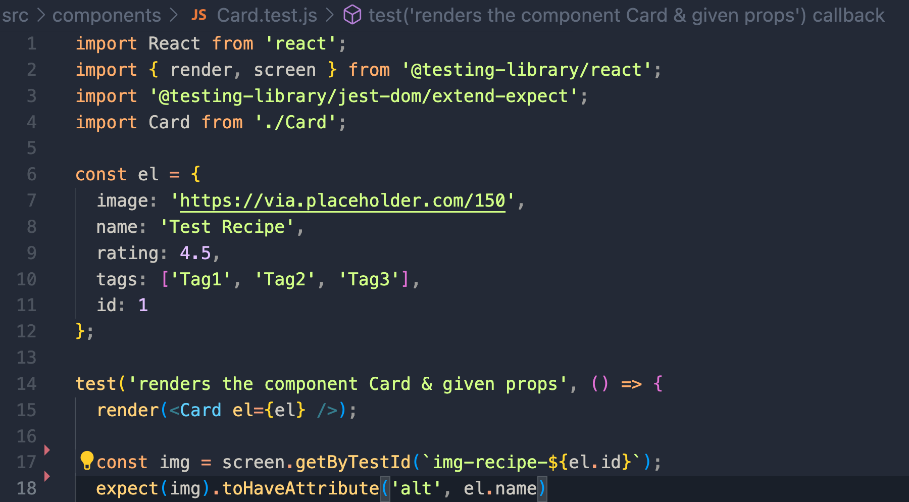

# Rimba Sahara - 1959095840-36

# Assignment 6 Bootcamp FGA Hacktiv8

# testing-case-react

Terdapat 4 file yang perlu kamu lakukan testing :

- App.jsx
- components/Card.jsx
- components/Footer.jsx
- components/NavBar.jsx

Tidak perlu melakukan testing terhadap semua element dan attribute yang ada, kamu cukup lakukan testing terhadap element yang memiliki data-testid. Antara lain :

1. `image-banner` img DONE
2. `img-recipe-n` (n merupakan value el.id dari props pada Card) img DONE
3. `title-recipe-n` h5 DONE
4. `rating-recipe-n` p DONE
5. `link-recipe-n` a DONE
6. `footer-text` p DONE
7. `link-facebook`a DONE
8. `link-x` a DONE
9. `link-instagram` a DONE
10. `my-recipe` h3 DONE
11. `form-search` form DONE

Hal yang perlu diperhatikan:

- Apabila element merupakan img maka perlu di test pada attribute `src` dan `alt`
- Apabila element merupakan text (h1-h6, p, span) maka perlu di test innerHTML dengan .toBe
- Apabila berupa anchor maka perlu test href-nya
- Pada element Card kamu bisa melakukan testing terhadap 1 data yang di hardcode sebagai props. Contoh sebagai berikut :
  

Jika tugas ini mudah untuk dikerjakan setelah selesai cobalah explore mengenai mock function.
